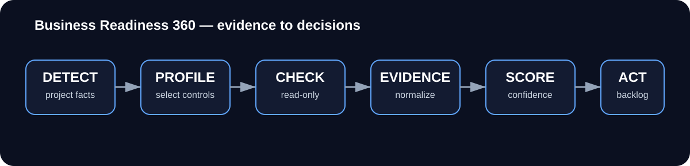

# AXDIA Business Readiness 360

> Evidence-based, local-first product and business readiness auditing for software projects.

[](./business-readiness-360.framework.json)
[](./BUSINESS_READINESS_360_RESULT.schema.json)
[](./runtime/br360_engine.py)
[](https://github.com/adrno496/axdia-business-readiness-360/actions/workflows/ci.yml)

**Business Readiness 360 (BR360)** audits a software project across technical, product and business-readiness dimensions without turning missing evidence into a positive result.

V3 combines a structured framework with a deterministic read-only audit engine:

- **125 controls**
- **24 audit domains**
- **20 project profiles**
- **15 built-in automated detectors**
- **11 discoverable external adapters**
- result schema **BR360-3**
- Python standard library only for the built-in engine

<p align="center">
  
</p>

## What problem does it solve?

A project can have clean code and still be unready for users, customers or paid production. BR360 creates one evidence model across areas such as security, production, licensing, UX, architecture, privacy, observability, product, growth and business.

It does **not** claim that one automated scan can prove a company or product is “ready”. Controls that require runtime, legal, manual or real-world evidence remain explicit until that evidence is supplied.

## Quick start

Run the self-test:

```bash
python3 runtime/br360_engine.py selftest
```

Audit a project:

```bash
python3 runtime/br360_engine.py audit \
  --project /path/to/project \
  --out br360-result.json
```

Import additional human/runtime/real-world evidence:

```bash
python3 runtime/br360_engine.py audit \
  --project /path/to/project \
  --evidence examples/evidence-input.example.json \
  --out br360-result-with-evidence.json
```

Compare two audits:

```bash
python3 runtime/br360_engine.py compare \
  --before audit-before.json \
  --after audit-after.json \
  --out audit-delta.json
```

List available external adapters:

```bash
python3 runtime/br360_engine.py adapters
```

## The 24 domains

Security · Supply chain · API · Authorization · Data · Privacy · Production · Resilience · Performance · Scalability · Observability · SRE · Architecture · Documentation · Accessibility · UX · Product · Analytics · Experimentation · Retention · Growth · Business · Licensing · AI

## Evidence model

The core pipeline is:

```text
Detect project
   ↓
Select profile and applicable controls
   ↓
Execute built-in read-only detectors
   ↓
Import authorized runtime / human / real-world evidence
   ↓
Normalize evaluations and evidence
   ↓
Generate findings, blockers and prioritized actions
   ↓
Compute scores + confidence + evidence strength + maturity
   ↓
Compare audit N with audit N+1
```

`PASS` only means the evidence required by **that control** was found. It does not mean the whole project is production-ready.

## Automation classes

| Class | Behavior |
|---|---|
| `AUTOMATED` | V3 executes the built-in detector when applicable |
| `SEMI_AUTOMATED` | requires tool/runtime/manual evidence; no fabricated success |
| `MANUAL` | explicit human review evidence required |
| `REAL_WORLD_REQUIRED` | real-world evidence is required for the related score |
| `LEGAL_REVIEW` | qualified legal review remains explicit |
| `EXTERNAL_RESEARCH` | external evidence remains explicit |

## Safety model

By default BR360 is **READ_ONLY** and local-first:

- no dependency installation;
- no project-file mutation;
- no commit/push/deploy;
- no automatic network execution;
- external adapters are opt-in;
- missing evidence does not become PASS.

## Current validation

The V3 package includes a deterministic regression suite and self-test. The launch candidate was validated with **29/29 unit/regression tests passing** and the BR360 self-test returning `PASS` before packaging.

Run the same checks locally:

```bash
python3 -m unittest discover -s tests -v
python3 runtime/br360_engine.py selftest
```

GitHub Actions re-runs them for public changes.

## Example uses

- pre-launch SaaS review;
- technical/product due diligence preparation;
- recurring readiness audits before releases;
- backlog generation from evidence gaps;
- comparing readiness before and after a remediation sprint;
- auditing AI-assisted projects where documentation and evidence may lag behind generated code.

## Extending BR360

Controls, profiles, scoring, maturity, evidence and adapter definitions live in structured JSON so the framework can evolve without hiding rules inside opaque prompts.

Start with:

- `business-readiness-360/controls/`
- `business-readiness-360/profiles/PROFILES.json`
- `business-readiness-360/scoring/SCORING_MODEL.json`
- `business-readiness-360/maturity/MATURITY_MODEL.json`
- `business-readiness-360/adapters/ADAPTERS.json`

## Contributing

See [`CONTRIBUTING.md`](./CONTRIBUTING.md). Reproducible false-positive/false-negative reports and framework feedback are welcome. Until the project-wide license/inbound contribution policy is finalized, external code contributions should wait.

## Research and attribution

BR360 was informed by a broad corpus of standards, tools and reference products. The project records its research/license matrix and states `code_copied=false` for the listed corpus references. See [`docs/research/BR360_LICENSE_MATRIX.md`](./docs/research/BR360_LICENSE_MATRIX.md) and [`business-readiness-360/references/BR360_REFERENCES.json`](./business-readiness-360/references/BR360_REFERENCES.json).

## License status

This launch pack does not invent a project-wide license that the source package did not already grant. Before adding MIT, Apache-2.0 or another license, confirm ownership of the first-party implementation and the treatment/attribution of all research-derived material. See [`LICENSING.md`](./LICENSING.md).

## AXDIA

BR360 is part of the **AXDIA** toolset for building, auditing and verifying software with AI-assisted workflows.

Website: **https://axdia.fr**

---

If the framework is useful, star the repository and share an audit gap or profile you would like covered next.
